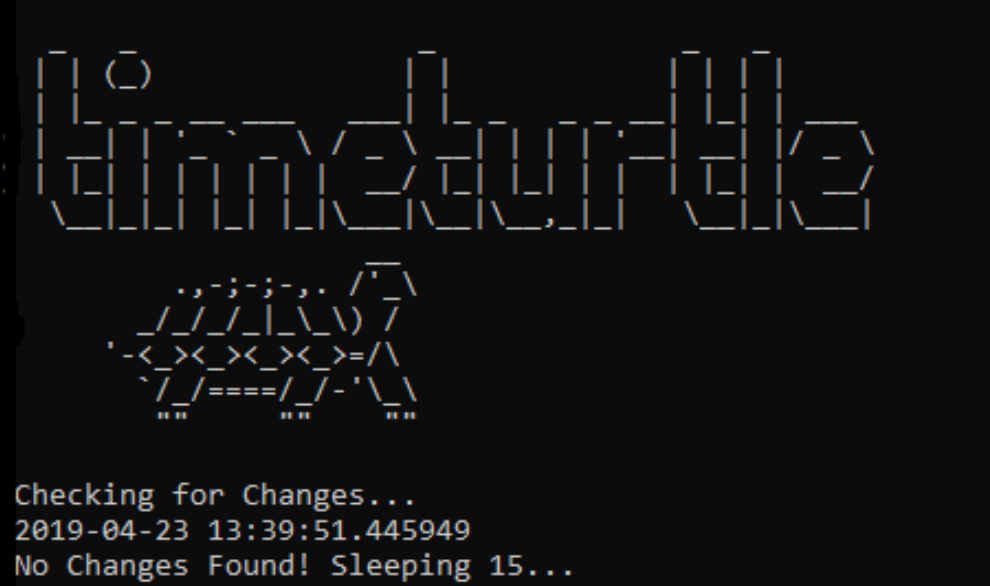

## Time Turtle Task Scheduler :alarm_clock: :turtle:
# What is Time Turtle?
Time Turtle schedules scripts to run on your machine.
It considers the workhour to run only during workhours.
I made it because I am trying to automate data cleaning processes,
I also made it so that others can trigger my code without knowing Python.
They can drop a file to be checked against our database in a shared drive folder.
Time Turtle will see the changes in modified date timestamps and execute different scripts.

# Why did I write time turtle?
Well I found myself trying to automate more and more things i.e. webscrapers/data gathering/visualizations/data scrubbing etc.
I heard good programmers are lazy, very lazy, so I wrote a script to run my scripts.



## Script is best run on a server or localhost
* Program is currently configured so that it is run by a bat file, this allows us to run the program in a flask server.
* Sniffs for changes and conditions including whether or not its a workday/workhour.
* Executes multiple scripts on a fifteen minute timer. (i.e. sleeps 60x15 seconds, can be changed to run more or less often)
* Calculates time until next workday at 6pm and Weekends and sleeps til then.

```
#put me in the while loop to add scripts
task('c','task name string','python script_filename.py',r'path:to\changes\\')
```
Happy Automating! :computer:
